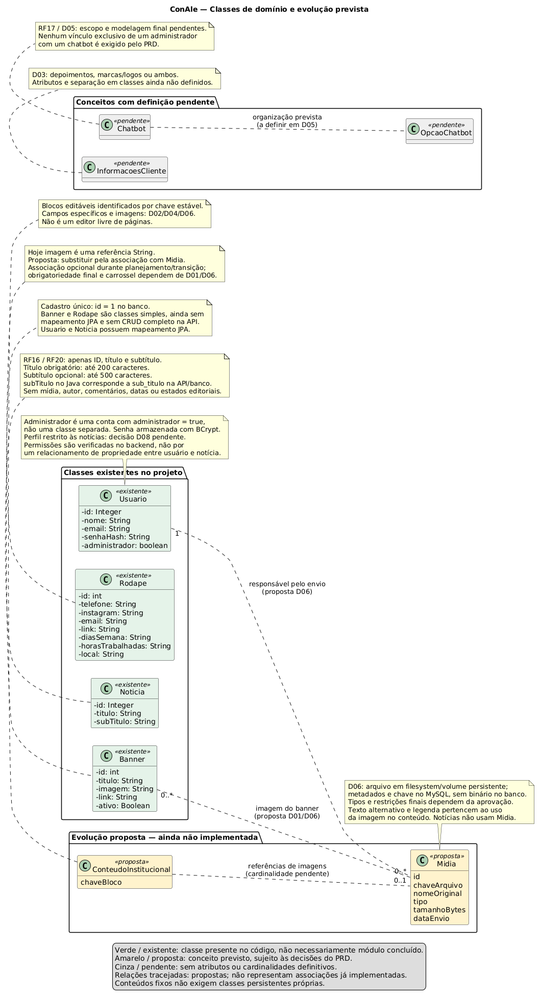
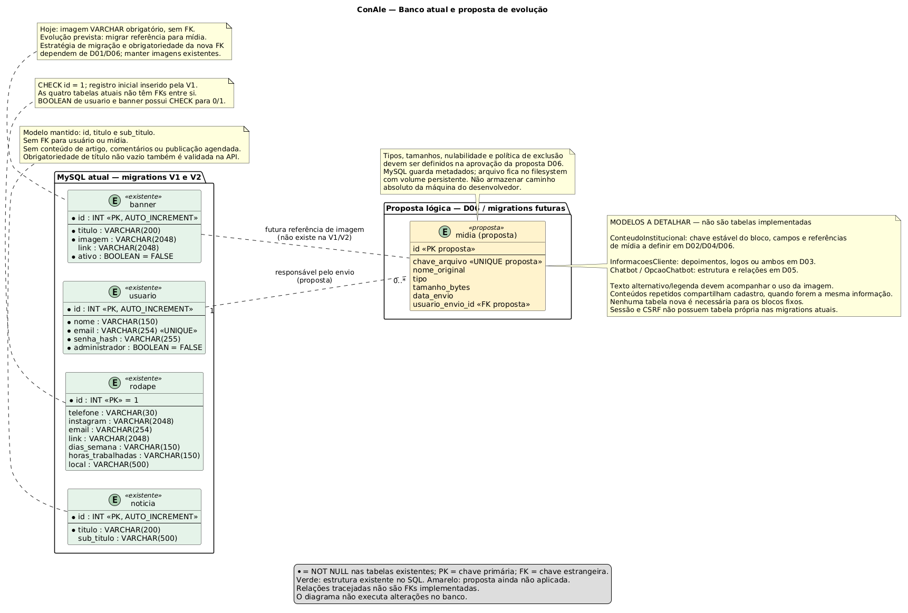
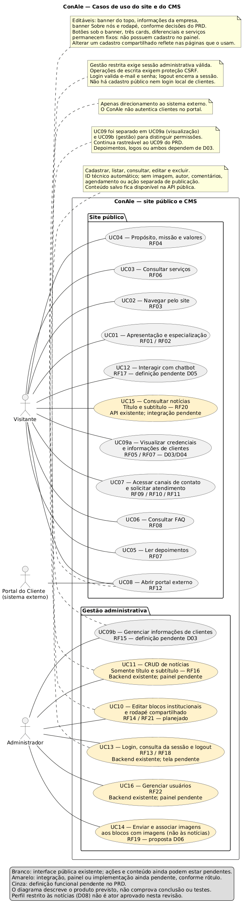

# PRD — ConAle

Revisão pós-P1 — 30/09/2026. Documento de trabalho para validação do grupo e da cliente.

## 1. Contexto e objetivo

A ConAle presta serviços contábeis especializados para profissionais e empresas da área da saúde. O projeto busca ampliar sua presença digital, apresentar serviços e credenciais, facilitar contatos e permitir que a equipe mantenha conteúdos institucionais e notícias sem depender de alterações no código.

A solução compreende um **site institucional público** e um **CMS administrativo**. O painel é uma interface frontend; o backend atende tanto o site quanto o painel, valida permissões e persiste dados. A Área do Cliente é um sistema externo e não se confunde com o painel administrativo.

## 2. Estado atual do projeto

Após a P1, o projeto possui frontend institucional e funcionalidades de backend desenvolvidas separadamente. A integração entre essas partes e a ampliação do CMS estão pendentes. A validação dos fluxos completos faz parte das próximas etapas.

| Parte | Estado atual |
| --- | --- |
| Frontend | React com páginas Home, Serviços, Sobre e Dúvidas Frequentes; conteúdos escritos nos componentes e imagens distribuídas com a aplicação. |
| Interações públicas | Há navegação, FAQ e links de e-mail/mapa. Alguns botões de contato e de acesso ao portal ainda não têm ação; há imagens provisórias. |
| Notícias no backend | CRUD com `id`, `titulo` e `sub_titulo`, conforme o escopo definido. O conteúdo das notícias é limitado a título e subtítulo. |
| Usuários e autenticação | CRUD de usuários e autenticação administrativa implementados no backend com Spring Security, BCrypt, sessão e proteção CSRF. |
| Integração | O frontend ainda não está conectado à API do backend e não possui páginas de notícias, login ou painel administrativo. |
| CMS ampliado | Upload de imagens para os blocos institucionais e edição desses blocos são funcionalidades planejadas. Notícias não utilizam imagens nem fluxo editorial separado. |

## 3. Escopo de conteúdo

Fixo significa mantido pelo desenvolvimento, não um elemento sem funcionamento. Botões fixos devem cumprir a navegação ou o contato anunciado.

| Bloco | Classificação confirmada pelo grupo | Operações previstas / limites |
| --- | --- | --- |
| Botões abaixo do banner | Fixo | Texto e estrutura mantidos no código; destinos funcionais. |
| Três cards da Home | Fixo | Conteúdo e estrutura mantidos no código. |
| Nossos diferenciais | Fixo | Sem cadastro no painel. |
| Nossos serviços | Fixo | Sem cadastro no painel. |
| Banner do topo | Editável | Atualizar imagem e campos presentes no layout; banner único ou carrossel depende de D01. |
| Informações da empresa — “spinner” | Editável | Campos e significado do bloco dependem de D02. |
| Banner “Sobre nós” da Home | Editável | Atualizar imagem e textos existentes, sem permitir alterar arbitrariamente a estrutura da página. |
| Notícias | Editável | Cadastrar, listar, consultar, editar e remover registros com título e subtítulo, conforme a seção 7. |
| Rodapé | Editável | Consultar e atualizar contatos, endereço, horários e links em um cadastro compartilhado. |
| Informações de clientes em “Sobre mim” | Editável | Coleção gerenciável; depoimentos, logos ou ambos dependem de D03. |

Um conteúdo repetido em mais de uma página deve utilizar o mesmo cadastro, quando representar a mesma informação. A repetição visual não exige CRUDs separados.

Os blocos não listados têm sua classificação pendente em D04, incluindo sua associação a conteúdos compartilhados. FAQ, missão/valores e credenciais dependem dessa definição. O chatbot é um requisito do PRD original ainda não implementado, com prioridade e alcance sujeitos a D05.

### Operações do painel

- Blocos únicos, como rodapé: consulta e atualização; não há necessidade de criar ou excluir vários rodapés.
- Coleções, como notícias e informações de clientes: cadastro, listagem, edição e remoção, conforme regras próprias.
- Banners: carrossel, ordenação e quantidade de registros dependem da definição de D01.
- Usuários: gestão administrativa restrita; não oferecer cadastro público de clientes.

## 4. Stack e arquitetura

| Camada | Tecnologia / responsabilidade |
| --- | --- |
| Frontend | React 19, TypeScript 6, Vite 8, React Router, React Icons e CSS. Versões exatas conforme manifesto e lockfile. |
| API | Java 24 e Spring Boot 3.5.16; HTTP com JSON. Upload futuro por multipart/form-data. |
| Segurança | Spring Security; hash BCrypt, sessão no servidor, cookie de sessão e proteção CSRF. |
| Persistência | Spring Data JPA e MySQL 8.4.11. |
| Evolução do banco | Flyway; novas migrations para ampliar o modelo, sem editar migrations já aplicadas. |
| Build e ambiente | Maven 3.9.9 no Dockerfile; Docker e Docker Compose. |
| Verificação | Testes Java/Spring e coleção Postman no repositório; ESLint no frontend. |
| Mídias | Proposta técnica pós-P1: arquivos em filesystem com volume persistente e metadados no MySQL; ver D06. |

Fluxo previsto: o site consulta conteúdo público; o painel envia alterações autenticadas ao backend; o backend verifica permissões e grava no banco e, para uploads, no armazenamento de arquivos. O navegador não acessa diretamente o banco ou o filesystem do servidor.

## 5. Requisitos funcionais

Os identificadores RF01–RF17 são preservados para rastreabilidade com a P1. Os requisitos descrevem o comportamento esperado do sistema; a seção 2 apresenta o estado atual de implementação.

| ID | Requisito revisado |
| --- | --- |
| RF01 | Apresentar a página inicial institucional. |
| RF02 | Apresentar a especialização em contabilidade para a área da saúde. |
| RF03 | Permitir navegação entre as páginas públicas e suas seções. |
| RF04 | Apresentar propósito, missão e valores; editabilidade pendente de D04. |
| RF05 | Apresentar credenciais e marcas conforme conteúdo aprovado; delimitação com RF15 em D03/D04. |
| RF06 | Apresentar serviços em conteúdo fixo, sem CRUD de serviços nesta revisão. |
| RF07 | Apresentar depoimentos; relação com a gestão de clientes depende de D03. |
| RF08 | Apresentar FAQ; sua editabilidade depende de D04. |
| RF09 | Exibir os canais de contato aprovados. |
| RF10 | Disponibilizar links funcionais para os canais de contato. |
| RF11 | Direcionar solicitações de atendimento ou interesse em contratação para canais externos; não contratar ou cobrar dentro do site. |
| RF12 | Direcionar ao portal externo da cliente, sem reproduzir seu login ou suas funções. |
| RF13 | Disponibilizar painel restrito aos administradores autorizados da ConAle. |
| RF14 | Permitir editar somente os blocos institucionais definidos na seção 3; não oferecer edição irrestrita de toda a página. |
| RF15 | Gerenciar informações de clientes; o requisito original tratava de marcas/logos, e sua ampliação para depoimentos depende de D03. |
| RF16 | Permitir cadastrar, listar, consultar, editar e remover notícias pelo painel, com apenas título e subtítulo como campos de conteúdo e ID gerado pelo sistema. |
| RF17 | Disponibilizar chatbot de orientação, conforme requisito original; prioridade e interação dependem de D05. |
| RF18 | Permitir login, consulta do usuário da sessão e logout; negar operações administrativas sem autorização. |
| RF19 | Permitir envio e associação de imagens aos banners e demais blocos editáveis que utilizam imagens, com validação no servidor e armazenamento persistente. Não se aplica às notícias. |
| RF20 | Exibir o título e o subtítulo das notícias cadastradas, consumindo a API pública. Cadastro, edição e exclusão devem refletir na próxima consulta do site, sem etapa separada de publicação. |
| RF21 | Permitir atualizar o rodapé em um único cadastro, refletido em todas as páginas que o utilizam. |
| RF22 | Disponibilizar gestão restrita de usuários no painel, respeitando as regras de acesso do backend; sem autorregistro público. |

## 6. Autenticação e acesso

O acesso administrativo permanece reservado aos administradores da ConAle. A implementação atual usa a propriedade `administrador` em `usuario`, não perfis editoriais por módulo.

Fluxo existente no backend, ainda a integrar ao frontend:

1. Obter token CSRF em `GET /api/auth/csrf`, mantendo o cookie da sessão.
2. Enviar e-mail e senha para `POST /api/auth/login`, com o cabeçalho CSRF informado pelo servidor.
3. O servidor valida a senha com BCrypt e verifica o acesso administrativo. No sucesso, troca o identificador da sessão e descarta o token CSRF anterior.
4. Obter novo token CSRF para as operações seguintes. Consultar `GET /api/auth/me` para identificar o administrador autenticado.
5. Enviar o cookie de sessão e o token CSRF nas operações de alteração que exigem essa proteção.
6. Executar `POST /api/auth/logout` para invalidar a sessão. A configuração atual prevê expiração após 30 minutos de inatividade.

O hash protege a senha armazenada; o cookie identifica a sessão; o token CSRF protege requisições contra falsificação. Não são o mesmo mecanismo, e o token CSRF não é um JWT nem comprova sozinho que a pessoa está autenticada.

A autorização deve ser validada no backend, independentemente da visibilidade dos botões na interface. HTTPS e configuração apropriada de cookies são necessários na implantação definitiva. O perfil “editor de notícias” depende de aprovação em D08.

## 7. Notícias: título e subtítulo

As notícias são registros de conteúdo breve, mantidos exclusivamente com título e subtítulo. O ID é um identificador técnico gerado pelo banco, não um campo de conteúdo preenchido pelo administrador.

| Campo | Regra |
| --- | --- |
| `id` | Gerado automaticamente; identifica o registro nas consultas, alterações e exclusões. |
| `titulo` | Obrigatório, não pode conter somente espaços e aceita até 200 caracteres. |
| `sub_titulo` | Opcional, aceita até 500 caracteres. |

O painel permite cadastrar, listar, consultar, editar e excluir notícias. Após o salvamento, o registro fica disponível na API pública; a integração do site deve refletir as alterações na próxima consulta. Não há ação separada de publicar, rascunhos, agendamento ou arquivamento. A exclusão remove o registro da consulta pública.

O módulo não inclui corpo de artigo, imagem de capa, galeria, campo de autoria, comentários ou estados/datas de publicação. Não requer editor de texto rico nem upload de arquivos. O armazenamento de imagens descrito na seção 8 atende aos demais conteúdos do CMS.

A gestão permanece restrita aos administradores. A possibilidade de um perfil com acesso somente às notícias continua como decisão de autorização em D08, sem ampliar os campos da notícia.

## 8. Imagens: armazenamento e ciclo de vida

Esta seção se aplica aos banners e aos demais blocos editáveis com imagens, não às notícias.

**Proposta técnica D06:** para implantação em um único servidor, armazenar os arquivos em filesystem, em diretório configurado e montado em volume Docker persistente. Guardar no MySQL apenas metadados e referências, não o binário da imagem. Essa proposta ainda não está implementada.

1. O administrador envia o arquivo pelo painel.
2. O backend valida sessão, autorização, CSRF, tamanho e tipo real do arquivo.
3. Gera uma chave interna segura, independente do nome original, e grava no volume com permissões para o usuário da aplicação.
4. Registra os metadados e associa a mídia ao conteúdo.
5. Entrega a imagem por endereço controlado pela aplicação; não expõe caminhos físicos do servidor.

Parâmetros propostos para aprovação: JPEG, PNG e WebP, até 5 MB por arquivo. Dimensões máximas, proporções e recorte dependem da definição de cada bloco em D06. A validação deve considerar o conteúdo do arquivo, além da extensão e do MIME enviado pelo navegador.

Regras a implementar junto ao upload:

- Não salvar uploads no código-fonte, no Git ou apenas na camada descartável do container.
- Manter banco e arquivos em backups recuperáveis; volume persistente não é backup.
- Exigir texto alternativo para imagens informativas; tratar imagens decorativas adequadamente.
- Substituir a referência somente após sucesso do novo upload; preservar a anterior em caso de falha.
- Tratar falhas entre gravação do arquivo e do banco, evitando referências quebradas e arquivos órfãos.
- Não apagar mídia ainda referenciada por outro bloco. Remover uma associação de imagem não deve apagar automaticamente um arquivo compartilhado.

Os arquivos atuais em `frontend/public` e `frontend/src/assets` são recursos distribuídos com o frontend, não uma solução de upload pelo CMS.

## 9. Modelagem revisada — proposta e implementação

Esta tabela apresenta a modelagem proposta para a evolução do sistema. As imagens dos diagramas abaixo representam a versão anterior e serão atualizadas para refletir o escopo desta revisão e as decisões pendentes.

### Diagrama de classes

### Modelo de dados

### Diagrama de casos de uso

### Entidades e responsabilidades

| Entidade | Situação e atributos / responsabilidade |
| --- | --- |
| Usuario | Existente: `id`, `nome`, `email`, `senha_hash`, `administrador`. Representa a conta; o indicador define acesso administrativo. |
| Noticia | Modelo definitivo para este escopo: `id`, `titulo`, `sub_titulo`, conforme a implementação existente. Sem relacionamento com mídia ou autor e sem novos campos editoriais. |
| Midia | Nova proposta: `id`, chave única do arquivo, nome original, tipo, tamanho em bytes, data de envio e usuário responsável. Texto alternativo/legenda devem acompanhar o uso da imagem no conteúdo. |
| Banner | Tabela existente com título, referência de imagem, link e ativo. Evoluir a referência para mídia; posição e multiplicidade dependem de D01. |
| ConteudoInstitucional | Proposta para blocos editáveis identificados por chave estável, com campos definidos por bloco e referências de mídia. Não é um construtor livre de páginas. Detalhar após D02/D04. |
| Rodape | Tabela existente para registro único com contatos, links, endereço e horários. Integrar edição e leitura ao site. |
| InformacoesCliente | Conceito pendente de D03. Se depoimento: nome, identificação profissional e texto; se marca: nome e mídia do logo. A organização em uma ou mais entidades depende dessa definição. |
| Chatbot / OpcaoChatbot | Previstos no PRD original e ainda não implementados. A modelagem final depende de D05. |

Relacionamentos propostos para os conteúdos com imagens: uma mídia pode ser referenciada por mais de um banner ou bloco institucional. Notícias não possuem relacionamento com mídia nem autoria. A permissão para gerenciar notícias é verificada pela autenticação e autorização, sem adicionar campos à entidade Noticia.

Os quatro blocos explicitamente fixos permanecem no código e não requerem tabelas próprias para gestão de conteúdo. Novos campos e tabelas dos demais módulos serão implementados por migrations. O modelo de notícias já atende ao escopo e não exige nova migration para esta definição.

## 10. Histórias e casos de uso

Mantêm-se as histórias institucionais da P1: conhecer especialização, serviços, propósito/valores, credenciais, depoimentos e FAQ; navegar; solicitar contato; acessar portal externo. As histórias administrativas passam a usar a delimitação da seção 3.

| História | Necessidade |
| --- | --- |
| HU-CMS01 | Como administrador, quero entrar e sair com segurança para proteger a gestão do conteúdo. |
| HU-CMS02 | Como administrador, quero atualizar apenas os blocos editáveis aprovados, sem depender de um desenvolvedor. |
| HU-CMS03 | Como administrador, quero cadastrar, editar e excluir notícias com título e subtítulo para manter o site atualizado. |
| HU-CMS04 | Como visitante, quero consultar os títulos e subtítulos das notícias disponibilizadas no site. |
| HU-CMS05 | Como administrador, quero atualizar contatos uma única vez para manter todas as páginas consistentes. |
| HU-CMS06 | Como administrador, quero gerenciar as informações de clientes conforme o formato aprovado. |
| HU-CMS07 | Como administrador, quero gerenciar contas sem permitir cadastro público ou acesso indevido. |

| Caso | Ator | Rastreabilidade |
| --- | --- | --- |
| UC01–UC06 | Visitante: apresentação, navegação, serviços, valores, depoimentos e FAQ | RF01–RF08, mantendo os casos da P1. |
| UC07 | Visitante: contato e interesse em contratação | RF09–RF11. |
| UC08 | Visitante: abrir portal externo | RF12. |
| UC09 | Visitante/administrador: visualizar/gerenciar informações de clientes | RF05, RF07, RF15; HU-CMS06; D03. |
| UC10 | Administrador: editar blocos institucionais e rodapé | RF14, RF21; HU-CMS02/05. |
| UC11 | Administrador: gerenciar notícias com título e subtítulo | RF16; HU-CMS03. |
| UC12 | Visitante: chatbot | RF17; pendente D05, preservado da P1. |
| UC13 | Administrador: login, consulta da sessão e logout | RF13, RF18; HU-CMS01. |
| UC14 | Administrador: enviar e associar mídia aos blocos com imagens | RF19; HU-CMS02. |
| UC15 | Visitante: listar e ler notícias | RF20; HU-CMS04. |
| UC16 | Administrador: gerenciar usuários | RF22; HU-CMS07. |

### Fluxos administrativos principais

**UC10:** usuário autenticado seleciona um bloco editável, consulta os dados, altera campos permitidos e confirma. O servidor valida e salva; as páginas que compartilham esse conteúdo passam a usar a atualização. Dados inválidos não substituem os anteriores. Falha de rede deve permitir nova tentativa sem afirmar que houve salvamento. Blocos fixos não aparecem como cadastros.

**UC11:** usuário autenticado lista notícias, cadastra ou seleciona uma e informa título e subtítulo. O servidor valida os campos e persiste o registro, gerando o ID no cadastro. Dados inválidos não alteram o registro anterior. Consulta, edição ou exclusão de ID inexistente retorna erro apropriado; exclusão exige confirmação na interface. O site passa a exibir o conteúdo salvo na próxima consulta à API. Não há envio de imagem nem etapa adicional de publicação.

**UC13:** seguir a sequência da seção 6. Credenciais inválidas não criam sessão autenticada. Sessão expirada solicita novo login. Requisições sem autorização ou com CSRF inválido são recusadas; logout impede continuar acessando recursos restritos com a sessão encerrada.

**UC14:** selecionar arquivo, enviar, validar no servidor, armazenar e associar ao conteúdo. Arquivo inválido, acima do limite ou falha de armazenamento deve resultar em mensagem clara, sem substituir a imagem anterior ou declarar sucesso.

**UC07/UC08:** o site utiliza destinos externos aprovados e mantém alternativas de contato visíveis. A detecção automática de aplicativos instalados e da disponibilidade de serviços externos não faz parte desse fluxo. O site não controla a autenticação nem a disponibilidade do portal externo.

## 11. Requisitos não funcionais e aceitação

| ID | Requisito / critério verificável |
| --- | --- |
| RNF01 | Layout legível e operável a partir de 360px; verificar navegação, formulários e ausência de cortes indevidos. |
| RNF02 | Respeitar o protótipo e a identidade visual aprovados; comparar telas públicas e administrativas. |
| RNF03 | Carregamento em até 3 segundos, conforme meta original. A avaliação depende da definição de métrica, páginas, conexão, dispositivo e cache em D11. |
| RNF04 | Verificar os fluxos principais em Chrome, Firefox e Edge, registrando versões utilizadas. |
| RNF05 | Validar autenticação e autorização no servidor; testar acessos diretos à API, não apenas à interface. |
| RNF06 | Apenas os blocos editáveis da seção 3 devem ser atualizados pelo painel sem alteração de código ou novo build do frontend. |
| RNF07 | Upload deve atender às regras da seção 8; formatos, tamanho e dimensões finais dependem de D06. |
| RNF08 | Preservar conteúdo e arquivos após recriação de containers sem apagar volumes; documentar e testar restauração de backup de ambos. |
| RNF09 | Formulários com rótulos, navegação por teclado, mensagens compreensíveis e texto alternativo adequado nas imagens. |
| RNF10 | Não expor senhas, hashes, caminhos internos ou detalhes sensíveis nas respostas; proteger credenciais de ambiente fora do Git. |

Evidências mínimas para a evolução: login válido/inválido, sessão e logout; CRUD de notícias e usuários; título obrigatório, limites dos campos e subtítulo opcional; exibição de título/subtítulo no site e atualização após edição/exclusão; alteração de rodapé refletida em duas páginas; upload aceito/recusado nos blocos com imagens; falha de upload preservando imagem anterior; recriação dos containers preservando mídias; botões públicos com destino correto. Se D08 for aprovada, acrescentar testes de permissões por módulo. Notícias não exigem testes de upload, rascunhos ou agendamento.

## 12. Decisões de escopo e pendências

Os identificadores são mantidos para rastreabilidade. D07, D09 e D10 estão resolvidas pela definição de notícias limitadas a título e subtítulo; as demais decisões permanecem pendentes.

| ID | Decisão / situação | Impacto |
| --- | --- | --- |
| D01 | Banner do topo único ou carrossel? Quais campos e quantidade máxima? | Cadastro único versus coleção/ordenação. |
| D02 | “Spinner” significa indicadores numéricos da empresa ou outro componente? Quais campos? | Define a estrutura e os campos editáveis do bloco. |
| D03 | Informações de clientes são depoimentos, logos ou ambos? | Define cadastros e relação entre RF05/RF07/RF15. |
| D04 | Classificar os demais conteúdos e identificar quais se repetem entre páginas. | Define o alcance do CMS e os cadastros compartilhados. |
| D05 | Confirmar prioridade, gestão e interação do chatbot previsto no PRD original. | Define o funcionamento do chatbot e sua distinção em relação ao FAQ. |
| D06 | Aprovar filesystem com volume para a implantação prevista, formatos/limites, dimensões, backup e recuperação. | Fecha armazenamento de imagens e critérios de upload. |
| D07 | Definida: notícias mantêm apenas título e subtítulo, além do ID técnico. | Sem corpo, capa, autoria ou fluxo editorial separado; preserva o modelo existente. |
| D08 | Pendente: haverá perfil com acesso somente à gestão de notícias? | Hoje somente administradores; novo perfil exige alteração de permissões, não dos campos da notícia. |
| D09 | Fora do escopo: agendamento de notícias. | Registros salvos ficam disponíveis na consulta pública, sem data ou estado de publicação. |
| D10 | Fora do escopo: comentários em notícias. | O módulo permanece limitado à gestão e exibição de título e subtítulo. |
| D11 | Definir cenário mensurável para a meta de desempenho. | Permite avaliar o desempenho por medições reproduzíveis. |

As decisões pendentes devem ser validadas pelo grupo e pela cliente antes da inclusão das funcionalidades correspondentes no escopo. Cada decisão deve registrar responsável e data, com atualização dos requisitos, diagramas e critérios de aceitação relacionados.

## 13. Fora do escopo confirmado

- Emissão/cálculo de guias, impostos ou obrigações contábeis.
- Substituição ou integração funcional com o portal contábil externo; permanece apenas o direcionamento.
- Login público de clientes dentro do site, pagamentos, cobrança, assinatura digital e aplicativo nativo.
- Atendimento contábil ou consultivo automatizado pelo chatbot.
- Edição pelo painel dos blocos explicitamente fixos na seção 3.

No módulo de notícias, ficam fora do escopo corpo de artigo, imagens, galerias, autoria, rascunhos, estados/datas de publicação, agendamento, comentários, arquivamento, versionamento e aprovação por múltiplos usuários. O perfil com acesso somente às notícias permanece pendente em D08 e não altera essa delimitação de conteúdo.

## 14. Sequência de evolução após a P1

1. Resolver as decisões pendentes dos blocos institucionais, mídias e permissões; manter o escopo de notícias definido na seção 7.
2. Sincronizar fontes e imagens dos diagramas, contratos da API e migrations planejadas.
3. Integrar autenticação e sessão ao painel e concluir os destinos dos botões públicos.
4. Implementar armazenamento de mídias para os blocos com imagens e integrar o CRUD existente de notícias ao painel e à exibição pública de título e subtítulo.
5. Integrar edição dos blocos aprovados, rodapé e informações de clientes.
6. Implementar funcionalidades condicionais somente após aprovação e revisão do esforço.
7. Validar fluxos completos, segurança, persistência, acessibilidade e desempenho; atualizar o README de execução.

O planejamento de cada entrega deve contemplar interface, API, banco, armazenamento e testes. A conclusão do CMS depende da integração desses elementos e da validação dos fluxos de uso pela cliente.

## 15. Glossário

- **CMS:** sistema para administrar os conteúdos definidos no escopo.
- **Painel Administrativo:** interface restrita da equipe, distinta do portal externo dos clientes.
- **Mídia:** arquivo enviado e seus metadados; sua referência no banco não é o arquivo binário.
- **Conteúdo fixo:** mantido no código; pode conter links e interações funcionais.
- **Conteúdo editável:** mantido pelo painel, dentro dos campos e regras aprovados.
- **Notícia:** registro com título e subtítulo, identificado por ID gerado pelo sistema e disponível na consulta pública após o salvamento.

## 16. Referências técnicas

- [Docker — Volumes](https://docs.docker.com/engine/storage/volumes/): persistência de arquivos fora do ciclo de vida do container.
- [OWASP — File Upload Cheat Sheet](https://cheatsheetseries.owasp.org/cheatsheets/File_Upload_Cheat_Sheet.html): validação e armazenamento seguro de uploads.
- Arquivos de referência do projeto: `frontend/package.json`, `frontend/src/App.tsx`, componentes públicos, `backend/pom.xml`, `SegurancaConfig.java`, `AuthController.java`, entidades JPA, migrations, `compose.yaml` e `backend/Dockerfile`.
